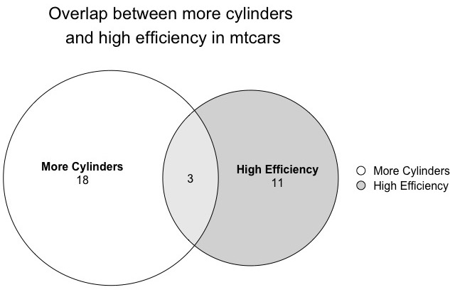

# plotVenn
Wrapper to plot euler/venn diagram in R

This package wraps up functions from the [eulerr](https://github.com/jolars/eulerr) package.

Install with
`devtools::install_github("gdmcdonald/plotVenn")`

Example
```r 
cars <- mtcars %>%
 transmute(`High Efficiency` = mpg>20,
           `More Cylinders` = cyl>=6)

plotVenn(cars, title = "Overlap between more cylinders\n and high efficiency in mtcars")
```



