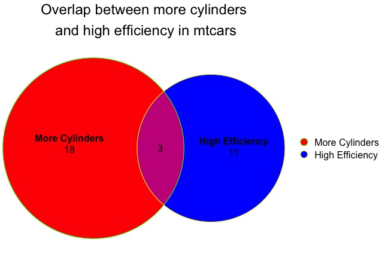

# plotVenn
Wrapper to plot euler/venn diagram in R

This package wraps up functions from the [eulerr](https://github.com/jolars/eulerr) package.

Install with
`devtools::install_github("gdmcdonald/plotVenn")`

Example
```r 
cars <- mtcars %>%
 transmute(`High Efficiency` = mpg>20,
           `More Cylinders` = cyl>=6)

plotVenn(cars, title = "Overlap between more cylinders\n and high efficiency in mtcars")
```


The table that was input, `cars`, looked like:

|                  |  High Efficiency| More Cylinders|
|------------------|-----------------|---------------|
|Mazda RX4         |             TRUE|           TRUE|
|Mazda RX4 Wag     |             TRUE|           TRUE|
|Datsun 710        |             TRUE|          FALSE|
|Hornet 4 Drive    |             TRUE|           TRUE|
|Hornet Sportabout |            FALSE|           TRUE|
|  .               |            .    |           .   |
|  .               |            .    |           .   |
|  .               |            .    |           .   |


Example with more colours
```r 
plotVenn(cars, 
        title = "Overlap between more cylinders\n and high efficiency in mtcars", 
        fills = c("red","blue"),
        edges = c("green","yellow"))
```

